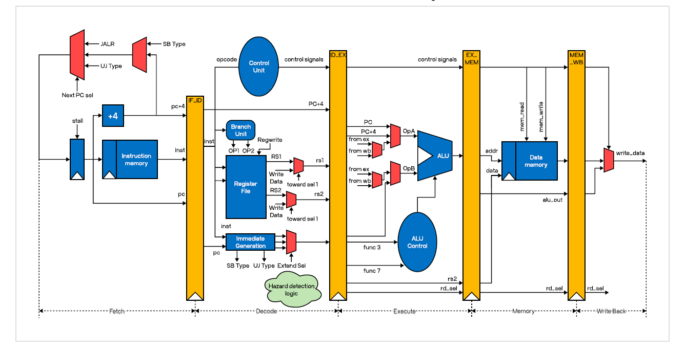
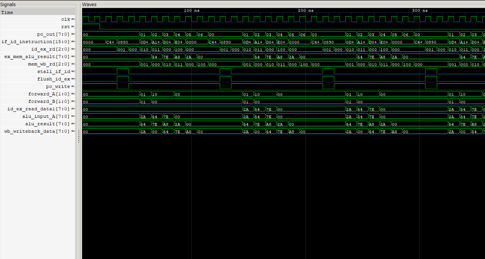

# 🚀 5-Stage Pipelined 8-bit RISC Processor

An open-source, 8-bit Reduced Instruction Set Computer (RISC) processor designed with a 5-stage pipeline architecture. This project implements a custom Instruction Set Architecture (ISA) and is built using Verilog. It is fully verifiable using open-source simulation tools.

### Pipeline Stages Breakdown
1. **Instruction Fetch (IF):** Fetches the target instruction from Instruction Memory using the Program Counter (PC).
2. **Instruction Decode (ID):** Decodes opcode/registers, reads operands from the Register File, and generates control signals.
3. **Execute (EX):** The Arithmetic Logic Unit (ALU) performs mathematical, logical, or address calculations.
4. **Memory Access (MEM):** Reads or writes data to the Data Memory for load/store operations.
5. **Write Back (WB):** Updates the Register File with the calculated ALU result or memory load value.

---

# Instruction Set Architecture (ISA)

| Instruction | Opcode | Operation         | Description            |
| ----------- | ------ | ----------------- | ---------------------- |
| ADD         | 000    | Rd = Rs1 + Rs2    | Add two registers      |
| SUB         | 001    | Rd = Rs1 − Rs2    | Subtract two registers |
| AND         | 010    | Rd = Rs1 & Rs2    | Bitwise AND            |
| OR          | 011    | Rd = Rs1 or Rs2    | Bitwise OR            |
| NOT         | 100    | Rd = ~Rs1         | Bitwise NOT            |
| STORE       | 101    | Mem[address] = Rs1| Store data in memory   |
| LOAD        | 110    | Rd = Mem[address] | Load data from memory  |
| JMP         | 111    | PC = address      | Jump to instruction    |

#### *MOV instruction is implemented by ADD Rd, Rs1, R0 ; R0 is hardwired to 0 so this instruction is equivalent to MOV

---

## 🖥️ Architecture & Verification

### Hardware Architecture


### Simulation Output Waveform


---

# 🛠️ Simulation & Toolchain

### Prerequisites
To simulate and view the waveforms locally, ensure you have the following tools installed:
* **Simulator:** [Icarus Verilog](http://iverilog.icarus.com/) (recommended) or Vivado/ModelSim
* **Waveform Viewer:** [GTKWave](https://gtkwave.sourceforge.net/)

### Quick Start Guide

Clone the repository and run the simulation using your terminal:

```bash
# 1. Clone the repository
git clone https://github.com/ggz4u/pipelined-risc-processor.git
cd pipelined-risc-processor

# 2. Compile the design files and testbench
iverilog -o riscv_tb.vvp pipelined_top_tb.v pipelined_top.v

# 3. Run the simulation
vvp riscv_tb.vvp

# 4. Open the waveform in GTKWave
gtkwave vcd/pipelined_top_tb.vcd
```
